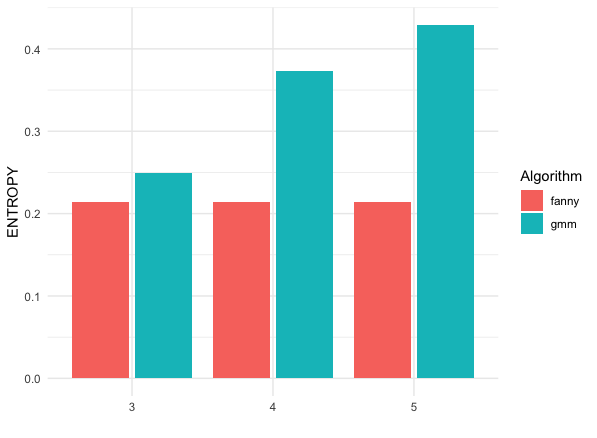
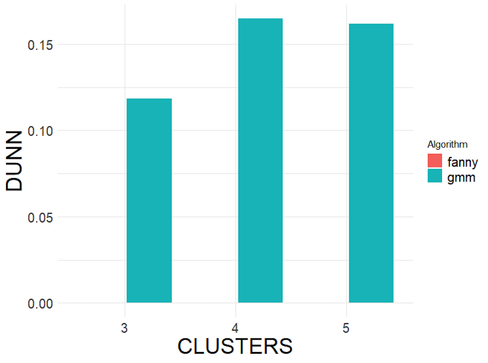

```{r setup, include=FALSE}
knitr::opts_chunk$set(echo = TRUE, fig.cap = "", fig.path = "Plot")
library("Clustering")
```


# Introduction

Exploring the properties of information in order to generate groups is an unsupervised learning technique known as clustering [@b46] [@b47]. This technique is a concise data model where a set of data must be partitioned and introduced into groups or clusters. These clusters must meet two conditions: clusters must be as disparate as possible; and the elements that contain them as similar as possible. Throughout the literature related to clustering we can see that there are multiple fields where they can be applied, among which we highlight the following: Identifying tourists and analyzing their destination patterns from location-based social media data [@b1]; developing clustering algorithms that maximize performance on 5G heterogeneous networks [@b2]; the application of data mining techniques to agriculture data [@b3]; weighting characteristics based on the strength between categories and within categories for the analysis of feelings [@b4]; music classification, genres and taste patterns [@b5]; predicting the direction of fluctuation, maximum, minimum and closing prices of the daily exchange rate of bitcoins [@b6]; and \texttt{clustering}  people in a given social network based on textual similarity [@b7].  

As a rule clustering algorithms are based on the optimization of an objective function, which is usually the weighted sum of the distance to the centers, although these functions may vary and in some cases consist of the definition of functions. In the literature we can group the data in different ways among which we highlight [@b48]: partitional, hierarchical or based on density. One of the best known algorithms that solves the clustering problem is the k-means [@b49].  

A wide variety of frameworks have been presented in the literature based on clustering algorithms such as: Weka [@b13], ClustVis [@b14] and Keel [@b15], among others. Also within R there is a specific Cluster task view. Inside the Cluster task view we can see two well differentiated parts: on the one hand we have the most outstanding packages by functionality and in the other hand we observe the ordered set of packages that work with clusters. Among the set of packages we highlight the following: **ClusterR** [@b9], **apcluster** [@b10], **cluster** [@b11], **advclust** [@b12] as well as alternatives to the traditional implementation of k-means and agglomerative hierarchical clustering.
Usually the task of comparing clustering algorithms is tedious, as it must be performed manually. This is quite time-consuming and in some cases there can be problems in transmitting the results. Similarly, when evaluating the distribution of data in clusters, it is necessary to indicate a categorical variable, so the selection of one variable or another from a data set can influence the results.  

This paper presents the **Clustering** package. It is a package that allows us to compare multiple clustering algorithms simultaneously and assess the accuracy of the results. The purpose of this package is to allow the evaluation of a set of datasets in order to determine which attributes are most suitable for clustering. So, we can perform evaluations of the clusters created, how they have been distributed, whether the distributions are uniform and how they have been categorized from the data.  

The structure of this contribution is as follows: Firstly, in section one \nameref{sec:clustering} we present the concepts of clustering, types of clustering and similarity measures. Section two \nameref{sec:seccion2} presents the definition of the evaluation measures in order to value the distribution of the data in the clusters. Finally, Section three\nameref{sec:seccion3} describes the structure of the package and presents a complete example about the use of the package.

# Clustering \label{sec:clustering}

Cluster analysis is an unsupervised learning method that constitutes a cornerstone of an intelligent data analysis process. It is used for the exploration of inter-relationships among a collection of patterns, by organizing them into homogeneous clusters. It is called unsupervised learning because, unlike classification (known as supervised learning), no a priori labeling of some of the patterns is available to use in categorizing others and inferring the cluster structure of the whole data set [@b17]. The basic concept of clustering should be expressed as follows:   

"Clustering is the process of identifying natural clusters or clusters within multidimensional data based on some measure of similarity (Euclidean, Manhattan, etc.) [@b18]."  

This is a base definition of clustering so variations in the problem definition can be significant, depending mostly on the model specified. For example, a generative model should define similarity based on a probabilistic generative mechanism, while a distance-based approach will use a traditional distance function to quantify it. In addition, the types of data specified have a significant impact on the problem definition.

## Clustering types

There are a variety of clustering algorithms that can be classified into: hierarchical, partitioning, density-based, grid-based and probability distribution [@b8].


* Hierarchical clustering: creates a hierarchical breakdown of data into a dendogram that recursively divides the data set into smaller and smaller groups. It can be created in two ways: bottom-up or top-down [@b19]. With the bottom-up method trees are known as agglomerative, as the objects are successively combined according to the measurements, until they are all joined into one or meet a completion condition. In the case of top-down, it is known as divisive, where all the objects are in the same group, and as we iterate they are divided into smaller subsets until each object is in an individual group or fulfills a condition of completion. An example of this type of clustering can be found in Figure ~\ref{hierarchical}. Some hierarchical grouping algorithms that belong to this sorting mode are: CURE [@b20], CHAMELEON [@b21], and BIRCH [@b22].  
\newpage
<center>
{height='185px'}
</center>
* Partitional clustering: is considered to be the most popular of the clustering algorithms. Such an algorithm is known as an iterative relocation algorithm. This algorithm minimizes a given clustering criterion by iteratively relocating data points between clusters until an optimal partition is reached. This type of algorithm divides the data points into a partition k, where each partition represents a cluster. Partial clustering organizes the objects within k clusters so that the total deviation of each object from the center of its cluster or from a cluster distribution is minimal. The deviation of a given point can be evaluated differently according to the algorithm, and is generally known as a similarity function. If we want to observe graphically how this type of clustering works we can see it in Figure ~\ref{partitional}. Among the partitioning clustering algorithms we can find CLARANS, CLARA [@b24], K-prototype [@b25], K-mode [@b26] and K-means [@b27].
<center>
{height='260px'}
</center>

* Density-based algorithms: obtain clusters based on dense regions of objects in the data space that are separated by low-density regions (these isolated elements represent noise). These regions are represented in Figure ~\ref{density}. Among the density-based algorithms, we highlight the following: Dbscan [@b28], and Denclue.
\newpage
<center>
{height='240px'}
</center>
* Grid-based clustering: first quantizes the clustering space into a finite number of cells and then performs the required operations on the quantized space [@b30]. Cells that contain more than a certain number of points are treated as dense, and the dense cells are connected to form the clusters. Some of the best known grid-based clustering algorithms include: STING [@b31], Wave Cluster [@b32] and CLIQUE [@b33].  


* Model-based methods: are primarily based on a probability distribution. To be able to measure similarity it is based on the mean values that the algorithm tries to minimize with the square error function. The Auto Class algorithm uses the Bayesian approach, starting with a random initialization of parameters that is gradually adjusted in order to find the maximum probability estimates. Among the model-based algorithms we highlight SOM [@b34]. Model-based clustering is shown in Figure ~\ref{model}.
<center>
{height='260px'}
</center>
\newpage

## Dissimilarity measures

Dissimilarity measurements are important in the creation of clusters with the closest neighbors and the detection of anomalies, and they are also used in a large number of data mining techniques. It is a measure that determines the degree to which objects are different. We often use the term distance as a synonym for dissimilarity. The values of dissimilarity should be in the range [0,1], but it is common to find in some cases the range 0 to $\infty$, ttherefore it is recommended to normalize the values in the range [0,1].  

Many distance measures have been proposed in the literature for data clustering. Choosing an appropriate similarity measure is crucial for cluster analysis, especially for a particular type of algorithm. For example, the density-based clustering algorithms, such as DBScan [@b28], rely heavily on the similarity computation. Density-based clustering finds clusters as dense areas in the data set, and the density of a given point is in turn estimated as the closeness of the corresponding data object to its neighboring objects [@b50] [@b51].  
As measures of dissimilarity in clustering we highlight the following:  


* Minkowski: Is a metric in a normalized vector space which can be considered as a generalization of both the Euclidean distance and the Manhattan distance [@b56].
    \begin{equation}
        d_{min} = (\sum_{i=1}^{n}|x_i - y_i|^m)^\frac{1}{m}, m\geq 1
    \end{equation}
    where m is a positive real number and $x_i$ and $y_i$ are two vectors in n-dimensional space.
* Euclidan distance: Is a special case of Minkowski distance. It is a measure of the true straight line distance between two points in a Euclidean space [@b19].
    \begin{equation}
        d_{euc} =  \sqrt{\sum_{i=1}^{n}(x_{i}-y_{i})^2}
    \end{equation}
* Manhattan distance: Known as the geometry cab driver is defined as the
sum of the lengths of the projections of the line segment between the points onto the coordinate axes [@b58].
     \begin{equation}
        d_{man} =  \sum_{i=1}^{n}|x_{i}-y_{i}|
    \end{equation}
* Mahalanobis distance: Is a data-driven measure in contrast to the Euclidean and Manhattan distances which are independent. It is tasked with measuring the distance in a multivariate space [@b58].
    \begin{equation}
        d_{mah}= \sqrt{(x-y)S^-1(x-y)^T}
    \end{equation}
    where S is the covariance matrix of the dataset.
* Pearson correlation: Pearson correlation: A statistically based metric that measures the linear correlation between two variables, x and y [@b61].
    \begin{equation}
        Pearson(x,y)= \frac{\sum_{i=1}^n(x_i-\mu_x)(y_i-\mu_y)}{\sqrt{\sum_{i=1}^n(x_i-y_i)^2}\sqrt{\sum_{i=1}^n(x_i-y_i)^2}}
    \end{equation}
    where $\mu_x$ and $\mu_y$ are the means for x and y respectively.
* Jaccard Index: Is a classical similarity measure performed on sets with several practical applications in information retrieval, data mining, machine learning, and many more [@b35] [@b59]. t measures the similarity of the two data elements as the intersection divided by the union of the data elements, as shown below.
    \begin{equation}
        J(A,B) = \frac{A \cap B}{A \cup B}
    \end{equation}
* Gower distance: It is a measure of similarity that allows the simultaneous use of quantitative, qualitative and dichotomous variables. By applying this similarity coefficient we can determine the degree of similarity between individuals who have had qualitative, quantitative characteristics (continuous and discrete) and binary characteridtics measured.
    \begin{equation}
        d_{ij}=\sqrt{(1-S_{ij})}
    \end{equation}
    found where $S_{ij}$ the Gower similarity coefficient is [@b62].
    \begin{equation}
        S_{ij}=\frac{\sum_{k}^{n}w_{ijk}S_{ijk}}{\sum_{n}^{k}w_{ijk}}
    \end{equation}
    $S_{ijk}$ denotes the contribution provided by the k-th variable, and $w_{ijk}$ is usually 1 or 0 depending on whether the comparison is valid for the k-th variable.

# Internal and External clustering validation measures \label{sec:seccion2}  

Clustering validation is a technique for finding a set of clusters that best fits natural partitions without any class information. The results of a clustering algorithm are known as cluster validity. The following criteria must therefore be taken into account when investigating the validity of clusters. The first criterion is based on external measures, which involves evaluating the results of a base algorithm in a pre-specified structure which is imposed on a data set and reflects our intuition about the structure of clustering of the data set. The second criterion is based on internal measures where the results of a clustering algorithm is evaluated in terms of the quantity involved in the vectors of the dataset itself (e.g. the proximity matrix). And there is a third criterion, known as the relative criterion, whose purpose is to compare the results of execution of an algorithm with another using different parameters.  

When we talk about criteria based on internal measures we must take into account the criteria of compactness and separation [@b53] [@b52] as can be seen in Figure \ref{cohesion}:  


* Compactness; the members of each cluster should be as close to each other as possible. A common measure of compactness is variance, which should be minimized.
* Separation; the clusters themselves should be widely spaced. There are three common approaches to measuring the distance between two different clusters:  
  * Single linkage: Measures the distance between the closest members of the clusters.
  * Complete linkage: Measures the distance between the most distant members.
  * Comparison of centroids: Measures the distance between the centers of the clusters.  

These criteria are graphically represented in the Figure \ref{separation}.  

![Intercluster distance [@b60]. \label{separation}](img/separation.png){height='223px'}  
 

Within external measures there are some measures to evaluate clustering results. Among these we highlight:  

* Entropy: Entropy: Evaluates the distribution of categories in a cluster [@b40].
    \begin{equation}
        Entropy(j) =  \sum_{j=1}^{m} \frac{|C_{j}|}{n}E_{j}
    \end{equation}
    Where $n_{j}$ the cluster size is j, n is the number of clusters, and m is the total number of data points. To calculate the \texttt{entropy} of a data set we need to calculate the class distribution of the objects in each group as follows.
    \begin{equation}
        E_{j} =  \sum_{i} p_{ij}log(p_{ij})
    \end{equation}
    Where $p_{ij}$ is the probability of a point in the cluster $i$ of being classified as class $j$.
* Recall: Indicates the proximity of the measurement results to the true value [@b41].
    \begin{equation}
         Recall(i,j) = \frac{n_{ij}}{|C_{i}|}
    \end{equation}
    $n_{ij}$ is the number of objects of class i that are in cluster j and $n_{i}$ is the number of objects in cluster i.
* Precision: Precision: Refers to the dispersion of the set of values obtained from repeated measurements of one magnitude [@b41].
        \begin{equation}
            Precision(i,j) = \frac{n_{ij}}{|C_{j}|}
        \end{equation}
     $n_{j}$ is the number of objects in cluster j.
* F-measure: F-measure: Merges the concepts of accuracy and recall of the information retrieved. Therefore, we calculate the cluster accuracy and recall for each class as.
    \begin{equation}
        F-measure(i,j) = \frac{2 * (Precision(i,j) * Recall(i,j))}{(Precision(i,j) + Recall(i,j))}
    \end{equation}
* Fowlkes-Mallows Index: It is a measure of comparison of hierarchical clustering. However, it can be used in flat clustering since it consists of the calculation of an index $B_{i}$ for each level i = 2 ,..., n-1 of the hierarchy [@b43]. The measure $B_{i}$ is easily generalizable. It can therefore be said that Fowlkes is a measure that can be interpreted as the geometric mean of accuracy (ratio between the number of relevant objects recovered and the total number of objects recovered).
    \begin{equation}
        Fowlkes(i,j) = \sqrt{Precision(i,j) * Recall(i,j)}
    \end{equation}
* Variation information: Variation in information or distance of shared information is a measure of the distance between two groups [@b43]. This measure is closely related to mutual information (mutual dependence between the two variables) [@b63].
    \begin{equation}
       VI(|C_{i}|,|C_{j}|) = 2H(C_{i},C_{j}) - H(C_{i}) - H(C_{j})
    \end{equation}
    $H(C_{i},C_{j})$ is the joint \texttt{entropy} of two clusters, $H(C_{i})$ is the \texttt{entropy} of $C_{i}$ and $H(C_{j})$ is the \texttt{entropy} of $C_{j}$.  
As with the external measures, we will now list the most relevant internal measures:  

* Connectivity: This measure reflects the extent to which items placed in the same group are considered their closest neighbors in the data space, i.e. the degree of connection of the clusters should be minimal [@b39].
    \begin{equation}
        Connectivity = min_{ 1\leq i \leq K} \left( min_{1\leq j \leq K, i\not= j} \left( \frac{dist(C_i,C_j)}{max_{1\leq k \leq K} \lbrace diam(C_k) \rbrace }  \right) \right)
    \end{equation}
    Where $dist(C_i,C_j)$ is the distance between two clusters and $diam(C_k)$ is the diameter of a particular cluster [@b39].
* Dunn: It represents the relationship of the smallest distance between observations that are not in the same cluster and the largest distance within the same cluster [@b44].
    \begin{equation}
    Dunn =  min_{1_\leq i\leq k} \left( min_{i+1\leq j \leq k}  \left( \frac{dist(C_i,C_j)}{max_{1_\leq l \leq k} diam(C_{k})} \right) \right)
    \end{equation}
   Where $dist(C_{i},C_{j})$ is distance between clusters $C_{i}$ and $C_{j}$ and $diam(C_{k})$ is the cluster diameter $C_{k}$.  
* Silhouette index: The silhouette value is a measure of how similar an object is to its own cluster (cohesion) compared to other clusters (separation) [@b45].
    \begin{equation}
        S = \frac{1}{N}\sum_{i=0}^{N}\frac{b_{i} - a_{i}}{max(a_{i},b_{i})}
    \end{equation}
    where $$a_{i}=\frac{1}{|C_{j}| - 1} \sum_{y\in C_{j},y\neq x_{i}}^{}\|y-x_{i}\|$$ and
    $$ b_{i} = \min\limits_{l \in H, l\neq j}^{} \frac{1}{|C_{l}|} \sum_{y \in C_{l}}^{} \| y - x_{i} \| $$ with
    $$ x_{i} \in C_{j}, H = \{h: 1 \leq h \leq K\}$$  

If we look at Figure ~\ref{external} we can group \texttt{Entropy, Recall, Precision, F-Measure, Fowlkes-Mallows Index and Variation information} into three families [@b54]:  

![External validation methods [@b54]. \label{external}](img/external.pdf){height='260'}

* Matching Sets: Used to compare two partitions of data. Consists of those methods that identify the relationship between each cluster detected in C and its natural correspondence to the classes in the reference result defined by P (clustering result prediction).  
Several measures can be defined for measuring the similarity between the clusters in C, obtained by the clustering algorithm, and the clusters in P, corresponding to our prior (external) knowledge. The metrics included in this method are: \texttt{Precision, Recall} and \texttt{F-measure}.  

* Peer-to-peer Correlation: Based on the correlation between pairs, i.e., they seek to measure the similarity between two partitions under equal conditions, such as the result of a grouping process for the same set, but by means of two different methods $ C_{i} $ and $ C_{j} $. It is assumed that the examples that are in the same cluster in $ C_{i} $ should be in the same class in $ C_{j} $, and vice-versa. In our package we use the metric: \texttt{Fowlkes-Mallows Index}.  

* Measures Based on Information Theory: A third family is based on Information Theory concepts, such as the existing uncertainty in the prediction of the natural classes provided by partition C. This family includes basic measures such as \texttt{Entropy} and \texttt{Variation Information}.

Internal evaluation metrics (see Figure ~\ref{cohesion}) do not require external information, so they are focused on measuring cohesion (how close the elements are to each other) and separation (they quantify the level of separation between clusters).

![Representation of cohesion and separation in clustering [@b54]. \label{cohesion}](img/cohesion.png){height='80px'}

According to the Figure ~\ref{internal}, the internal \texttt{Dunn, Silhouette} and \texttt{Connectivity} metrics are based on the concepts mentioned above so we can group them as partitioning methods.

![Internal validation methods [@b54]. \label{internal}](img/internal.pdf){height='95px'}

# The **Clustering** package \label{sec:seccion3} 

The **Clustering** package has been written entirely in R language. The package include other packages with hierarchical, partitional and agglomerative algorithms. The package has been provided with the ability to read data in different formats such as CSV, \href{https://sci2s.ugr.es/keel/references.php}{KEEL}, \href{https://www.cs.waikato.ac.nz/ml/weka/}{ARFF (Weka)} and \texttt{data.frame} objects. This package implements functionality not developed until now. In current implementations we cannot run several algorithms simultaneously. This option is very useful to compare the results of several algorithms. Another very useful option, not found until now is the ability to run all the dissimilarity measures implemented for an algorithm in the same run, i.e., run for example the K-means algorithm for the Euclidean and Manhattan dissimilarity measures simultaneously. This perspective is quite interesting when it comes to secidong what measure to use in the execution of the algorithm. In order to evaluate the quality of the clusters we find packages that perform external or internal evaluations, but there was no implementation that give us a joint evaluation of both. Finishing the review we find that when evaluating the quality of clusters it is necessary to indicate an attribute of the dataset used in the execution. Depending on the chosen attribute, results may vary, so it would be important to have methods that give us the result of running each of the quality measures by attribute, the measure of dissimilarity in the case of it existing, the number of clusters and algorithm. With this **Clustering** package we will be able to execute simultaneously several algorithms for each of the implemented dissimilarity measures. In addition, when evaluating the results of the executions we have a set of measures that are executed together, which until now was done one execution per measure. It is possible to incorporate new measures quickly in the future. In addition, when running the algorithm all the attributes of the dataset will be executed for each of the quality metrics. The results of the executions are visually displayed so that you can draw conclusions quickly.

## Package algorithms  

These are the algorithms \footnote{For more information about the advclust, amap, apcluster, cluster, Cluster, gmp, pvclust packages you can visit the following link \url{https://cran.r-project.org/web/packages/available_packages_by_name.html}} available within the package, which we will classify as follows: 

* Hierarchical Clustering: \texttt{agnes, clara, daisy, diana, fanny, fuzzy\_cm, fuzzy\_gk, fuzzy\_gg, hcluster, mona, pam, pvpick and pvclust.}
* Partitioning Clustering: \texttt{gama, gmm, kmeans}.
* Aglomerative Clustering: \texttt{aggExCluster, apclusterK}.

## Package Architecture  

The main class of the package is the \texttt{Clustering} object.  

* \texttt{clustering()}: This object stores the results of the **Clustering** package execution and contains the following properties: 
    * \texttt{result.} It represents the \texttt{data.frame} with the results. In each column we have represented the evaluation metrics used to evaluate the clusters. We can see the execution time of these metrics, datasets, the correspondence between the evaluation metric calculation and the dataset attribute, the measures of similarity and the algorithms.
    * \texttt{has\_internal\_metrics.} It is a boolean operator that indicates if we have used internal evaluation measures in the calculation.
    * \texttt{has\_external\_metrics.} It is a boolean operator that indicates if we have used external evaluation measures in the calculation.
    * \texttt{algorithms\_executed.} It represents a character vector with the algorithms executed independently of the package.
    * \texttt{measures\_executed.} It represents a vector of characters with the measures of similarity used by the algorithms indicated.  

This class exports the well-known S3 methods \texttt{print()} and \texttt{summary()} that show the data structure without codification, and a summary with basic information about the dataset respectively. We can perform sorting and filtering operations for further processing of the results. In any case if we need to perform filtering operations we can overload the operator ('[') in order to perform such operations in an easier way.

* External metrics: For external metrics we have a set of methods by which we can determine the behavior of the algorithms based on the best attribute of the data set, measures of dissimilarity and the number of clusters. The methods are as follows:
    * \texttt{best\_ranked\_external\_metrics()}: With the execution of this method we obtain which attribute of the data set has better behavior by algorithm, measure of dissimilarity and number of clusters.
    * \texttt{evaluate\_best\_validation\_external\_by\_metrics()}: This method should be used to group the data by algorithm and dissimilarity measure, instead of obtaining the best attribute from the data set.
    * \texttt{evaluate\_validation\_external\_by\_metrics()}: Method for grouping the results of the execution by algorithms.
    * \texttt{result\_external\_algorithm\_by\_metric()}: It is used for obtaining the results of an algorithm indicated as a parameter grouped by number of clusters.
    
* Internal metrics: For internal metrics we have the same set of methods as mentioned above for external metrics.
    * \texttt{best\_ranked\_internal\_metrics()}: With the execution of this method we obtain which attribute of the data set has better behavior by algorithm, measure of dissimilarity and number of clusters.
    * \texttt{evaluate\_best\_validation\_internal\_by\_metrics()}: This method should be used to group the data by algorithm and dissimilarity measure, instead of obtaining the best attribute from the data set.
    * \texttt{evaluate\_validation\_internal\_by\_metrics()}: Method for grouping the results of the execution by algorithms.
    * \texttt{result\_internal\_algorithm\_by\_metric()}: It is used for obtaining the results of an algorithm indicated as a parameter grouped by number of clusters.
    
* \texttt{plot\_clustering()}: Method that represents the results of clustering in a bar chart. The graph represents the distribution of the algorithms based on the number of partitions and the evaluation metrics which can be internal or external.
* \texttt{export\_external\_file()}: The results of external metrics can be exported in \LaTeX format, for integration into documents with that format.
* \texttt{export\_internal\_file()}: As indicated above, we use this method to export the results of the internal metrics.

## Use of **Clustering** package  

The fastest way to download the **Clustering** package and use it is to use the install instruction.
```{r, fig.align='center', echo=TRUE, eval=FALSE }
install.packages("Clustering")
```
A development version is available on the github repository \url{https://github.com/laperez/Clustering}. To use the development version you must install the \texttt{devtools} package and use the \texttt{install\_github method()}.

```{r, fig.align='center', echo=TRUE, eval=FALSE }
devtools::install_github('laperez/Clustering')

```

The main dependencies of the **Clustering**  package are: \texttt{advclust, amap, apcluster, cluster, ClusterR, gmp and pvclust}. These are the packages used for implementing the clustering algorithms. We can find dependencies for data processing and GUI, such as \texttt{shiny} and \texttt{DT} among others. Once the package is installed it is necessary to load it in the following way:

```{r, fig.align='center', echo=TRUE, eval=FALSE }
library("Clustering")
```
Once the installation and loading process has been completed, we proceed with the processing of the data and its execution.

## Load and use of datasets  

For the execution of the main method of the package we must provide data which can be in different formats. The file formats accepted by the package are: KEEL, ARFF and CSV. The data can be loaded in two ways: firstly we can indicate a directory with files in the formats indicated above and load all the available files; and secondly we can provide a \texttt{data.frame} with the necessary data for execution. In order to read the files in ARFF format it has been extracted from the **mldr** package [@b55].  

If we need to work with test data, we have pre-loaded data. The loaded datasets have been obtained from the KEEL repository url \url{https://sci2s.ugr.es/keel/category.php?cat=uns} in CSV format.  

Note that the extension is used to determine the type of file format.

## Analysis of clustering methods using the **Clustering** package

Once the way to provide the data has been defined the next step is to be able to execute the main method of the application, which is \texttt{clustering()}. With this method we can compare the clustering algorithms included in the aforementioned packages. When comparing we can do it by packages or simply by indicating the algorithms contained in them. In partitional clustering it is necessary to indicate the number of partitions, which can be fixed or of a range. To evaluate how the data have been distributed in the clusters, a set of evaluation measures are performed that return numeric values. One improvement built into the package is that in addition to returning the numerical value of the metrics, it can return the dataset attribute corresponding to that value. In addition, the algorithms are executed for all measures of similarity implemented. All this functionality is incorporated into the main method. Therefore the parameters of the \texttt{clustering()} method are the following:  

* \texttt{path}: The file path. It is only allowed to use \texttt{path} or \texttt{df} but not both at the same time. Only files in \texttt{.dat, .csv} or \texttt{.arff} format are allowed.
* \texttt{df}: Data matrix or data frame, or similarity matrix.
* \texttt{packages}: Character vector with the packets running the algorithm. The seven packages implemented are: cluster, ClusterR, advclust, amap, apcluster, gama, pvclust. By default the system runs all packages.
* \texttt{algorithm}: Is an array with the list of the algorithms implemented by the packages. The algorithms are: \texttt{fuzzy\_cm, fuzzy\_gg,fuzzy\_gk, hclust, apclusterK, agnes, clara, daisy, diana, fanny, mona, pam, gmm, kmeans\_arma, kmeans\_rcpp, mini\_kmeans, gama, pvclust}.
* \texttt{min}: An integer with the minimum number of clusters This data is necessary to indicate the minimum number of clusters when grouping the data. The default value is 3.
* \texttt{max}: An integer with the maximum number of clusters. This data is necessary to indicate the maximum number of clusters when grouping the data. The default value is 4.
* \texttt{metrics}: Character vector with the metrics implemented in order to evaluate the distribution of the data in clusters. The night metrics implemented are: \texttt{entropy, variation\_information, precision,recall,f\_measure,fowlkes\_mallows\_index,connectivity,dunn,silhouette}.
* \texttt{metricsAttr}: Character vector with the metrics implemented in order to evaluate the distribution of the data in clusters. The nine metrics implemented are: \texttt{entropy, variation\_information, precision,recall,f\_measure,fowlkes\_mallows\_index,connectivity,dunn,silhouette}. This column is the same as the previous one, with the difference that it shows the dataset attribute.
* \texttt{attributes}: A boolean datum which indicates whether we want to show as a result the attributes of the datasets. The default value is F.

```{r, fig.align='center', echo=TRUE, eval=FALSE }

result <- Clustering::clustering(df = basketball, min = 3, max = 5, algorithm = c('gmm',
                        'fanny'), metrics = c('entropy','dunn'), attributes = T)

```

The attributes resulting from the execution of the method are:  

* \texttt{Algorithm:} Indicates the clustering algorithm used in the data processing.
  \item \texttt{Distance:} Is the measure of similarity used by the algorithm to calculate the similarity between the data.
* \texttt{Clusters:} Is the number of clusters used by the algorithm. Used in Partitional Clustering.
* \texttt{Dataset:} Is the name of the \texttt{data.frame} \texttt{dataframe} appears by default, but if instead of using the \texttt{df} parameter in the clustering method we use path (directory with files with extension dat), in the column must appear the names of the processed datasets.
* \texttt{timeExternal:} Time taken to implement external evaluation measures.
* \texttt{metrics:} Each metric indicated in the execution is presented in individual columns. In this case we have both external (\texttt{entropy}) and internal (\texttt{dunn}) metrics.
  Note: in the metric field we indicate all the measurements we wish to evaluate. The metrics implemented are: \texttt{entropy}, \texttt{recall}, \texttt{precision}, \texttt{f\_measure}, \texttt{fowlkes\_mallows\_index}, \texttt{connectivity}, \texttt{dunn} and \texttt{silhouette}.
* \texttt{timeInternal:} Time taken to implement internal evaluation measures.
* \texttt{timeExternalAttr:} Time taken to implement external evaluation measures by attribute.
* \texttt{metricsAttr:} The same metrics that instead of showing numerical values show the attributes of the dataset.
* \texttt{timeInternalAttr:} Time taken to implement internal evaluation measures by attribute.  

In Table ~\ref{tab:clustering} we have the results of the execution of the \texttt{clustering()} method. According to the results, the algorithm that better bejaves for the \texttt{entropy} metric is \texttt{gmm}, as highlighted in Table ~\ref{tab:clustering}.  

\begin{longtable}{| p{1.1cm} | p{2cm} | p{0.8cm} | p{1.3cm} | p{0.60cm} | p{0.7cm} | p{0.65cm} | p{0.65cm} | p{0.65cm} | p{0.65cm} | p{0.7cm} | p{0.65cm} |}
\hline
\scriptsize  Algorithm & \scriptsize  Distance  &  \scriptsize Clusters & \scriptsize  Dataset & \scriptsize tE  & \scriptsize entropy & \scriptsize  dunn  & \scriptsize tI & \scriptsize tEAttr  & \scriptsize enAttr & \scriptsize duAttr & \scriptsize tIAttr \\
\hline
\scriptsize     gmm   & \scriptsize   gmm\_euclidean & \scriptsize    3    & \scriptsize basketball & \scriptsize    0.0042  &  \scriptsize 0.2374  & \scriptsize 0.1096 & \scriptsize    0.0004  &  \scriptsize    5  & \scriptsize    2  & \scriptsize    1  & \scriptsize    1 \\
\scriptsize     gmm   & \scriptsize   gmm\_euclidean  & \scriptsize    3   &  \scriptsize basketball  & \scriptsize    0.0046  &  \scriptsize 0.2120  & \scriptsize 0.1096 & \scriptsize    0.0004 &   \scriptsize    1  & \scriptsize    4 &  \scriptsize    2 &  \scriptsize    2 \\
\scriptsize     gmm   & \scriptsize   gmm\_euclidean & \scriptsize    3   &  \scriptsize basketball & \scriptsize    0.0079  &  \scriptsize 0.0064  &\scriptsize 0.1096 & \scriptsize    0.0005 &   \scriptsize    3  &  \scriptsize    3  &  \scriptsize    3  & \scriptsize    3 \\
\scriptsize     gmm   & \scriptsize   gmm\_euclidean & \scriptsize    3 &  \scriptsize basketball & \scriptsize    0.0081  &  \scriptsize 0.0032  & \scriptsize 0.1096 & \scriptsize    0.0005 &   \scriptsize    2  & \scriptsize    5  & \scriptsize    4  & \scriptsize    4 \\
\scriptsize     gmm   & \scriptsize   gmm\_euclidean & \scriptsize    3     & \scriptsize basketball & \scriptsize    0.0089  &  \scriptsize 0.0000 &  \scriptsize 0.1096 & \scriptsize    0.0006 &   \scriptsize    4  & \scriptsize    1  & \scriptsize    5  & \scriptsize    5 \\
\cline{3-12}
\scriptsize     gmm   & \scriptsize   gmm\_euclidean & \scriptsize    4     & \scriptsize basketball  & \scriptsize    0.0041  & \scriptsize 0.3734 &  \scriptsize 0.1233 & \scriptsize    0.0004 &   \scriptsize    5 & \scriptsize    2  & \scriptsize    1  & \scriptsize    4 \\
\scriptsize     gmm   & \scriptsize   gmm\_euclidean & \scriptsize    4     & \scriptsize basketball & \scriptsize    0.0041 &   \scriptsize 0.2983 & \scriptsize 0.1233 & \scriptsize    0.0004 &   \scriptsize    2 & \scriptsize    4 &  \scriptsize    2 &  \scriptsize    5 \\
\scriptsize     gmm   & \scriptsize   gmm\_euclidean & \scriptsize    4     & \scriptsize basketball & \scriptsize    0.0071  &  \scriptsize 0.0064 &  \scriptsize 0.1233 & \scriptsize    0.0004 &   \scriptsize    4 &  \scriptsize    3 &  \scriptsize    3 &  \scriptsize    1 \\
\scriptsize     gmm   & \scriptsize   gmm\_euclidean & \scriptsize    4     & \scriptsize basketball & \scriptsize    0.0071   & \scriptsize 0.0032 &  \scriptsize 0.1233 & \scriptsize    0.0004 &   \scriptsize    1 &  \scriptsize    5  & \scriptsize    4  & \scriptsize    2 \\
\scriptsize     gmm   & \scriptsize   gmm\_euclidean & \scriptsize    4     & \scriptsize basketball & \scriptsize    0.0193   & \scriptsize 0.0000 &  \scriptsize 0.1233 & \scriptsize    0.0005 &   \scriptsize    3 &  \scriptsize    1 &  \scriptsize    5 &  \scriptsize    3 \\
\cline{3-12}
\scriptsize     gmm   & \scriptsize   gmm\_euclidean & \scriptsize    5     & \scriptsize basketball & \scriptsize    0.0044   & \scriptsize 0.4175 &  \scriptsize 0.1619 & \scriptsize    0.0004 &   \scriptsize    3 &  \scriptsize    2  & \scriptsize    1  & \scriptsize    1 \\
\scriptsize     gmm   & \scriptsize    gmm\_euclidean & \scriptsize    5    & \scriptsize basketball & \scriptsize    0.0045  &  \scriptsize 0.3857 & \scriptsize 0.1619 & \scriptsize    0.0004 & \scriptsize   1  & \scriptsize    4  & \scriptsize    2  & \scriptsize    4 \\
\scriptsize     gmm   & \scriptsize    gmm\_euclidean & \scriptsize    5    & \scriptsize basketball & \scriptsize    0.0079  &  \scriptsize 0.0064 & \scriptsize 0.1619 & \scriptsize    0.0004 & \scriptsize   4  & \scriptsize    3  & \scriptsize    3  & \scriptsize    5 \\
\scriptsize     gmm   & \scriptsize    gmm\_euclidean & \scriptsize    5    & \scriptsize basketball & \scriptsize    0.0079  &  \scriptsize 0.0032 & \scriptsize 0.1619 & \scriptsize    0.0005 & \scriptsize   2  & \scriptsize    5  & \scriptsize    4  & \scriptsize    3 \\
\scriptsize     gmm   & \scriptsize    gmm\_euclidean & \scriptsize    5    & \scriptsize basketball & \scriptsize    0.0091  &  \scriptsize 0.0000 & \scriptsize 0.1619 & \scriptsize    0.0005 & \scriptsize   5  & \scriptsize    1  & \scriptsize    5  & \scriptsize    2 \\
\cline{2-12}
\scriptsize     gmm   & \scriptsize    gmm\_manhattan & \scriptsize    3    & \scriptsize basketball & \scriptsize    0.0030  &  \scriptsize 0.2498 & \scriptsize 0.1151 & \scriptsize    0.0004 & \scriptsize   3  & \scriptsize    2  & \scriptsize    1  & \scriptsize    4 \\
\scriptsize     gmm   & \scriptsize    gmm\_manhattan & \scriptsize    3    & \scriptsize basketball & \scriptsize    0.0036  &  \scriptsize 0.2201 & \scriptsize 0.1151 & \scriptsize    0.0004 & \scriptsize   2  & \scriptsize    4  & \scriptsize    2  & \scriptsize    1 \\
\scriptsize     gmm   & \scriptsize    gmm\_manhattan & \scriptsize    3    & \scriptsize basketball & \scriptsize    0.0067  &  \scriptsize 0.0064 & \scriptsize 0.1151 & \scriptsize    0.0004 & \scriptsize   5  & \scriptsize    3  & \scriptsize    3  & \scriptsize    5 \\
\scriptsize     gmm   & \scriptsize    gmm\_manhattan & \scriptsize    3    & \scriptsize basketball & \scriptsize    0.0073  &  \scriptsize 0.0032 & \scriptsize 0.1151 & \scriptsize    0.0005 & \scriptsize   1  & \scriptsize    5  & \scriptsize    4  & \scriptsize    2 \\
\scriptsize     gmm   & \scriptsize    gmm\_manhattan & \scriptsize    3    & \scriptsize basketball & \scriptsize    0.0075  &  \scriptsize 0.0000 & \scriptsize 0.1151 & \scriptsize    0.0005 & \scriptsize   4  & \scriptsize    1  & \scriptsize    5  & \scriptsize    3 \\
\cline{3-12}
\scriptsize     gmm   & \scriptsize    gmm\_manhattan & \scriptsize    4    & \scriptsize basketball & \scriptsize    0.0034  &  \scriptsize 0.3563 & \scriptsize 0.1179 & \scriptsize    0.0004 & \scriptsize   4  & \scriptsize    2  & \scriptsize    1  & \scriptsize    4 \\
\scriptsize     gmm   & \scriptsize    gmm\_manhattan & \scriptsize    4    & \scriptsize basketball & \scriptsize    0.0049  &  \scriptsize 0.2919 & \scriptsize 0.1179 & \scriptsize    0.0004 & \scriptsize   2  & \scriptsize    4  & \scriptsize    2  & \scriptsize    1 \\
\scriptsize     gmm   & \scriptsize    gmm\_manhattan & \scriptsize    4    & \scriptsize basketball & \scriptsize    0.0068  &  \scriptsize 0.0064 & \scriptsize 0.1179 & \scriptsize    0.0004 & \scriptsize   5  & \scriptsize    3  & \scriptsize    3  & \scriptsize    2 \\
\scriptsize     gmm   & \scriptsize    gmm\_manhattan & \scriptsize    4    & \scriptsize basketball & \scriptsize    0.0073  &  \scriptsize 0.0032 & \scriptsize 0.1179 & \scriptsize    0.0005 & \scriptsize   1  & \scriptsize    5  & \scriptsize    4  & \scriptsize    5 \\
\scriptsize     gmm   & \scriptsize    gmm\_manhattan & \scriptsize    4    & \scriptsize basketball & \scriptsize    0.0076  &  \scriptsize 0.0000 & \scriptsize 0.1179 & \scriptsize    0.0007 & \scriptsize   3  & \scriptsize    1  & \scriptsize    5  & \scriptsize    3 \\
\cline{3-12}
\rowcolor{green} \scriptsize     gmm   & \scriptsize    gmm\_manhattan & \scriptsize    5    & \scriptsize basketball & \scriptsize    0.0032  &  \scriptsize 0.4290 & \scriptsize 0.1141 & \scriptsize    0.0004 & \scriptsize   4  & \scriptsize    2  & \scriptsize    1  & \scriptsize    1 \\
\scriptsize     gmm   & \scriptsize    gmm\_manhattan & \scriptsize    5    & \scriptsize basketball & \scriptsize    0.0036  &  \scriptsize 0.3887 & \scriptsize 0.1141 & \scriptsize    0.0004 & \scriptsize   1  & \scriptsize    4  & \scriptsize    2  & \scriptsize    5 \\
\scriptsize     gmm   & \scriptsize    gmm\_manhattan & \scriptsize    5    & \scriptsize basketball & \scriptsize    0.0072  &  \scriptsize 0.0064 & \scriptsize 0.1141 & \scriptsize    0.0005 & \scriptsize   3  & \scriptsize    3  & \scriptsize    3  & \scriptsize    4 \\
\scriptsize     gmm   & \scriptsize    gmm\_manhattan & \scriptsize    5    & \scriptsize basketball & \scriptsize    0.0079  &  \scriptsize 0.0032 & \scriptsize 0.1141 & \scriptsize    0.0007 & \scriptsize   2  & \scriptsize    5  & \scriptsize    4  & \scriptsize    2 \\
\scriptsize     gmm   & \scriptsize    gmm\_manhattan & \scriptsize    5    & \scriptsize basketball & \scriptsize    0.0084  &  \scriptsize 0.0000 & \scriptsize 0.1141 & \scriptsize    0.0011 & \scriptsize   5  & \scriptsize    1  & \scriptsize    5  & \scriptsize    3 \\
\cline{1-12}
\scriptsize   fanny   & \scriptsize  fanny\_euclidean & \scriptsize    3    & \scriptsize basketball & \scriptsize    0.0107  &  \scriptsize 0.2069 & \scriptsize 0.0000 & \scriptsize    0.0000 & \scriptsize   5  & \scriptsize    4  & \scriptsize    1  & \scriptsize    1 \\
\scriptsize   fanny   & \scriptsize  fanny\_euclidean & \scriptsize    3    & \scriptsize basketball & \scriptsize    0.0114  &  \scriptsize 0.1675 & \scriptsize 0.0000 & \scriptsize    0.0000 & \scriptsize   2  & \scriptsize    2  & \scriptsize    2  & \scriptsize    2 \\
\scriptsize   fanny   & \scriptsize  fanny\_euclidean & \scriptsize    3    & \scriptsize basketball & \scriptsize    0.0140  &  \scriptsize 0.0032 & \scriptsize 0.0000 & \scriptsize    0.0000 & \scriptsize   4  & \scriptsize    3  & \scriptsize    3  & \scriptsize    3 \\
\scriptsize   fanny   & \scriptsize  fanny\_euclidean & \scriptsize    3    & \scriptsize basketball & \scriptsize    0.0159  &  \scriptsize 0.0032 & \scriptsize 0.0000 & \scriptsize    0.0000 & \scriptsize   1  & \scriptsize    5  & \scriptsize    4  & \scriptsize    4 \\
\scriptsize   fanny   & \scriptsize  fanny\_euclidean & \scriptsize    3    & \scriptsize basketball & \scriptsize    0.0161  &  \scriptsize 0.0000 & \scriptsize 0.0000 & \scriptsize    0.0000 & \scriptsize   3  & \scriptsize    1  & \scriptsize    5  & \scriptsize    5 \\
\cline{3-12}
\scriptsize   fanny   & \scriptsize  fanny\_euclidean & \scriptsize    4    & \scriptsize basketball & \scriptsize    0.0123  &  \scriptsize 0.2069 & \scriptsize 0.0000 & \scriptsize    0.0000 & \scriptsize   3  & \scriptsize    4  & \scriptsize    1  & \scriptsize    1 \\
\scriptsize   fanny   & \scriptsize  fanny\_euclidean & \scriptsize    4    & \scriptsize basketball & \scriptsize    0.0128  &  \scriptsize 0.1675 & \scriptsize 0.0000 & \scriptsize    0.0000 & \scriptsize   1  & \scriptsize    2  & \scriptsize    2  & \scriptsize    2 \\
\scriptsize   fanny   & \scriptsize  fanny\_euclidean & \scriptsize    4    & \scriptsize basketball & \scriptsize    0.0157  &  \scriptsize 0.0032 & \scriptsize 0.0000 & \scriptsize    0.0000 & \scriptsize   4  & \scriptsize    3  & \scriptsize    3  & \scriptsize    3 \\
\scriptsize   fanny   & \scriptsize  fanny\_euclidean & \scriptsize    4    & \scriptsize basketball & \scriptsize    0.0157  &  \scriptsize 0.0032 & \scriptsize 0.0000 & \scriptsize    0.0000 & \scriptsize   2  & \scriptsize    5  & \scriptsize    4  & \scriptsize    4 \\
\scriptsize   fanny   & \scriptsize  fanny\_euclidean & \scriptsize    4    & \scriptsize basketball & \scriptsize    0.0178  &  \scriptsize 0.0000 & \scriptsize 0.0000 & \scriptsize    0.0000 & \scriptsize   5  & \scriptsize    1  & \scriptsize    5  & \scriptsize    5 \\
\cline{3-12}
\scriptsize   fanny   & \scriptsize  fanny\_euclidean & \scriptsize    5    & \scriptsize basketball & \scriptsize    0.0167  &  \scriptsize 0.2069 & \scriptsize 0.0000 & \scriptsize    0.0000 & \scriptsize   3  & \scriptsize    4  & \scriptsize    1  & \scriptsize    1 \\
\scriptsize   fanny   & \scriptsize  fanny\_euclidean & \scriptsize    5    & \scriptsize basketball & \scriptsize    0.0189  &  \scriptsize 0.1675 & \scriptsize 0.0000 & \scriptsize    0.0000 & \scriptsize   2  & \scriptsize    2  & \scriptsize    2  & \scriptsize    2 \\
\scriptsize   fanny   & \scriptsize  fanny\_euclidean & \scriptsize    5    & \scriptsize basketball & \scriptsize    0.0219  &  \scriptsize 0.0032 & \scriptsize 0.0000 & \scriptsize    0.0000 & \scriptsize   4  & \scriptsize    3  & \scriptsize    3  & \scriptsize    3 \\
\scriptsize   fanny   & \scriptsize  fanny\_euclidean & \scriptsize    5    & \scriptsize basketball & \scriptsize    0.0272  &  \scriptsize 0.0032 & \scriptsize 0.0000 & \scriptsize    0.0000 & \scriptsize   1  & \scriptsize    5  & \scriptsize    4  & \scriptsize    4 \\
\scriptsize   fanny   & \scriptsize  fanny\_euclidean & \scriptsize    5    & \scriptsize basketball & \scriptsize    0.0286  &  \scriptsize 0.0000 & \scriptsize 0.0000 & \scriptsize    0.0000 & \scriptsize   5  & \scriptsize    1  & \scriptsize    5  & \scriptsize    5 \\
\cline{2-12}
\scriptsize   fanny   & \scriptsize  fanny\_manhattan & \scriptsize    3    & \scriptsize basketball & \scriptsize    0.0165  &  \scriptsize 0.2143 & \scriptsize 0.0000 & \scriptsize    0.0000 & \scriptsize   3  & \scriptsize    4  & \scriptsize    1  & \scriptsize    1 \\
\scriptsize   fanny   & \scriptsize  fanny\_manhattan & \scriptsize    3    & \scriptsize basketball & \scriptsize    0.0184  &  \scriptsize 0.1658 & \scriptsize 0.0000 & \scriptsize    0.0000 & \scriptsize   1  & \scriptsize    2  & \scriptsize    2  & \scriptsize    2 \\
\scriptsize   fanny   & \scriptsize  fanny\_manhattan & \scriptsize    3    & \scriptsize basketball & \scriptsize    0.0196  &  \scriptsize 0.0032 & \scriptsize 0.0000 & \scriptsize    0.0000 & \scriptsize   4  & \scriptsize    3  & \scriptsize    3  & \scriptsize    3 \\
\scriptsize   fanny   & \scriptsize  fanny\_manhattan & \scriptsize    3    & \scriptsize basketball & \scriptsize    0.0247  &  \scriptsize 0.0032 & \scriptsize 0.0000 & \scriptsize    0.0000 & \scriptsize   5  & \scriptsize    5  & \scriptsize    4  & \scriptsize    4 \\
\scriptsize   fanny   & \scriptsize  fanny\_manhattan & \scriptsize    3    & \scriptsize basketball & \scriptsize    0.0719  &  \scriptsize 0.0000 & \scriptsize 0.0000 & \scriptsize    0.0000 & \scriptsize   2  & \scriptsize    1  & \scriptsize    5  & \scriptsize    5 \\
\cline{3-12}
\scriptsize   fanny   & \scriptsize  fanny\_manhattan & \scriptsize    4    & \scriptsize basketball & \scriptsize    0.0152  &  \scriptsize 0.2143 & \scriptsize 0.0000 & \scriptsize    0.0000 & \scriptsize   4  & \scriptsize    4  & \scriptsize    1  & \scriptsize    1 \\
\scriptsize   fanny   & \scriptsize  fanny\_manhattan & \scriptsize    4    & \scriptsize basketball & \scriptsize    0.0159  &  \scriptsize 0.1658 & \scriptsize 0.0000 & \scriptsize    0.0000 & \scriptsize   1  & \scriptsize    2  & \scriptsize    2  & \scriptsize    2 \\
\scriptsize   fanny   & \scriptsize  fanny\_manhattan & \scriptsize    4    & \scriptsize basketball & \scriptsize    0.0183  &  \scriptsize 0.0032 & \scriptsize 0.0000 & \scriptsize    0.0000 & \scriptsize   5  & \scriptsize    3  & \scriptsize    3  & \scriptsize    3 \\
\scriptsize   fanny   & \scriptsize  fanny\_manhattan & \scriptsize    4    & \scriptsize basketball & \scriptsize    0.0189  &  \scriptsize 0.0032 & \scriptsize 0.0000 & \scriptsize    0.0000 & \scriptsize   2  & \scriptsize    5  & \scriptsize    4  & \scriptsize    4 \\
\scriptsize   fanny   & \scriptsize  fanny\_manhattan & \scriptsize    4    & \scriptsize basketball & \scriptsize    0.0193  &  \scriptsize 0.0000 & \scriptsize 0.0000 & \scriptsize    0.0000 & \scriptsize   3  & \scriptsize    1  & \scriptsize    5  & \scriptsize    5 \\
\cline{3-12}
\scriptsize   fanny   & \scriptsize  fanny\_manhattan & \scriptsize    5    & \scriptsize basketball & \scriptsize    0.0178  &  \scriptsize 0.2143 & \scriptsize 0.0000 & \scriptsize    0.0000 & \scriptsize   4  & \scriptsize    4  & \scriptsize    1  & \scriptsize    1 \\
\scriptsize   fanny   & \scriptsize  fanny\_manhattan & \scriptsize    5    & \scriptsize basketball & \scriptsize    0.0183  &  \scriptsize 0.1658 & \scriptsize 0.0000 & \scriptsize    0.0000 & \scriptsize   1  & \scriptsize    2  & \scriptsize    2  & \scriptsize    2 \\
\scriptsize   fanny   & \scriptsize  fanny\_manhattan & \scriptsize    5    & \scriptsize basketball & \scriptsize    0.0207  &  \scriptsize 0.0032 & \scriptsize 0.0000 & \scriptsize    0.0000 & \scriptsize   3  & \scriptsize    3  & \scriptsize    3  & \scriptsize    3 \\
\scriptsize   fanny   & \scriptsize  fanny\_manhattan & \scriptsize    5    & \scriptsize basketball & \scriptsize    0.0211  &  \scriptsize 0.0032 & \scriptsize 0.0000 & \scriptsize    0.0000 & \scriptsize   2  & \scriptsize    5  & \scriptsize    4  & \scriptsize    4 \\
\scriptsize   fanny   & \scriptsize  fanny\_manhattan & \scriptsize    5    & \scriptsize basketball & \scriptsize    0.0211  &  \scriptsize 0.0000 & \scriptsize 0.0000 & \scriptsize    0.0000 & \scriptsize   5  & \scriptsize    1  & \scriptsize    5  & \scriptsize    5 \\
\hline
\caption{Results of running the main method of the package.}
\label{tab:clustering}
\end{longtable}
To make compression easier we have extracted the values of the \texttt{gmm} algorithm with five clusters the and \texttt{manhattan} measurement. The values are arranged in descending order. The values in the columns ending in Attr refer to the attributes of the dataset. As already mentioned, the attributes of the dataset are numbered from left to right in ascending order. Thus \texttt{assists per minute} which is the first attribute of the dataset found on the left is numbered with 1, \texttt{height} with 2, \texttt{time played} with 3, \texttt{age} with 4 and \texttt{points per minute} with 5.

\begin{longtable}{| p{1.1cm} | p{2cm} | p{0.8cm} | p{1.3cm} | p{0.60cm} | p{0.7cm} | p{0.65cm} | p{0.65cm} | p{0.65cm} | p{0.65cm} | p{0.7cm} | p{0.65cm} |}
\hline
\scriptsize  Algorithm & \scriptsize  Distance  &  \scriptsize Clusters & \scriptsize  Dataset & \scriptsize tE & \scriptsize entropy & \scriptsize  dunn  & \scriptsize tI & \scriptsize tEAttr & \scriptsize enAttr & \scriptsize duAttr & \scriptsize tIAttr  \\
\hline
\scriptsize     gmm   & \scriptsize    gmm\_manhattan & \scriptsize    5    & \scriptsize basketball & \scriptsize    0.0032  &  \scriptsize 0.4290 & \scriptsize 0.1141 & \scriptsize    0.0004 & \scriptsize   4  & \scriptsize    2  & \scriptsize    1  & \scriptsize    1 \\
\scriptsize     gmm   & \scriptsize    gmm\_manhattan & \scriptsize    5    & \scriptsize basketball & \scriptsize    0.0036  &  \scriptsize 0.3887 & \scriptsize 0.1141 & \scriptsize    0.0004 & \scriptsize   1  & \scriptsize    4  & \scriptsize    2  & \scriptsize    5 \\
\scriptsize     gmm   & \scriptsize    gmm\_manhattan & \scriptsize    5    & \scriptsize basketball & \scriptsize    0.0072  &  \scriptsize 0.0064 & \scriptsize 0.1141 & \scriptsize    0.0005 & \scriptsize   3  & \scriptsize    3  & \scriptsize    3  & \scriptsize    4 \\
\scriptsize     gmm   & \scriptsize    gmm\_manhattan & \scriptsize    5    & \scriptsize basketball & \scriptsize    0.0079  &  \scriptsize 0.0032 & \scriptsize 0.1141 & \scriptsize    0.0007 & \scriptsize   2  & \scriptsize    5  & \scriptsize    4  & \scriptsize    2 \\
\scriptsize     gmm   & \scriptsize    gmm\_manhattan & \scriptsize    5    & \scriptsize basketball & \scriptsize    0.0084  &  \scriptsize 0.0000 & \scriptsize 0.1141 & \scriptsize    0.0011 & \scriptsize   5  & \scriptsize    1  & \scriptsize    5  & \scriptsize    3 \\
\hline
\caption{Example of calculation of the attributes of a dataset by algorithm, means and cluster number.}
\label{tab:clusteringExample}
\end{longtable}
The name of the column \texttt{tE} corresponds to \texttt{timeExternal}, \texttt{tI} to \texttt{timeInternal}, \texttt{tEAttr} to \texttt{timeExternalAttr}, \texttt{enAttr} to \texttt{entropyAttr}, \texttt{duAttr} to \texttt{dunnAttr} and finally \texttt{tIAttr} to \texttt{timeInternalAttr}. From the data in Table ~\ref{tab:clusteringExample} in row one we have the highest value of entropy for the basketball dataset. If we want to know the dataset attribute for the maximum value we look in the equivalent column of the metric, in our case as we are centered on \texttt{entropy} we must look in the column \texttt{enAttr}, which indicates that it is attribute two that corresponds to height.  

In order to summarize the information this package provides a series of mechanisms that allow us to summarize the information from the result obtained by the clustering method in such a way that we can obtain the best results and attributes for one or several data sets. The mechanisms used are the following:  

* \texttt{best\_ranked\_external\_metrics()}: Method used for selecting from the data set attributes those that obtain the best result in the evaluation of the measure. We will now use this mechanism on the previous results.
```{r, fig.align='center', echo=TRUE, eval=FALSE }
Clustering::best_ranked_external_metrics(result)

```
\newpage
\begin{table}[h!]
\centering
\begin{tabular}{| p{1.3cm} | p{2.1cm} | p{0.9cm} | p{1.1cm} | p{1.6cm} | p{0.8cm} | p{2.1cm} | p{1.5cm} |}
\hline
\scriptsize Algorithm  & \scriptsize     Distance    &  \scriptsize Clusters &  \scriptsize  Dataset   & \scriptsize timeExternal  & \scriptsize entropy   & \scriptsize timeExternalAttr & \scriptsize entropyAttr \\
\hline
\scriptsize   gmm      & \scriptsize   gmm\_euclidean & \scriptsize     3     & \scriptsize basketball  & \scriptsize     0.0104    & \scriptsize 0.2374 &  \scriptsize        5        & \scriptsize      2 \\
\scriptsize   gmm      & \scriptsize   gmm\_euclidean & \scriptsize     4     & \scriptsize basketball  & \scriptsize     0.0147    & \scriptsize 0.3734 &  \scriptsize        2        & \scriptsize      2\\
\scriptsize   gmm      & \scriptsize   gmm\_euclidean & \scriptsize     5     & \scriptsize basketball  & \scriptsize     0.0058    & \scriptsize 0.4175 &  \scriptsize        5        & \scriptsize      2 \\
\cline{2-8}
\scriptsize   gmm      & \scriptsize   gmm\_manhattan & \scriptsize     3     & \scriptsize basketball  & \scriptsize     0.0066    & \scriptsize 0.2498 &  \scriptsize        5        & \scriptsize      2 \\
\scriptsize   gmm      & \scriptsize   gmm\_manhattan & \scriptsize     4     & \scriptsize basketball  & \scriptsize     0.0083    & \scriptsize 0.3563 &  \scriptsize        4        & \scriptsize      2 \\
\scriptsize   gmm      & \scriptsize   gmm\_manhattan & \scriptsize     5     & \scriptsize basketball  & \scriptsize     0.0045    & \scriptsize 0.4290 &  \scriptsize        5        & \scriptsize      2 \\
\hline
\scriptsize fanny      & \scriptsize fanny\_euclidean & \scriptsize     3     & \scriptsize basketball  & \scriptsize     0.0177    & \scriptsize 0.2069 &  \scriptsize        5        & \scriptsize      4 \\
\scriptsize fanny      & \scriptsize fanny\_euclidean & \scriptsize     4     & \scriptsize basketball  & \scriptsize     0.0148    & \scriptsize 0.2069 &  \scriptsize        5        & \scriptsize      4 \\
\scriptsize fanny      & \scriptsize fanny\_euclidean & \scriptsize     5     & \scriptsize basketball  & \scriptsize     0.0199    & \scriptsize 0.2069 &  \scriptsize        1        & \scriptsize      4 \\
\cline{2-8}
\scriptsize fanny      & \scriptsize fanny\_manhattan & \scriptsize     3     & \scriptsize basketball  & \scriptsize     0.0311    & \scriptsize 0.2143 &  \scriptsize        3        & \scriptsize      4 \\
\scriptsize fanny      & \scriptsize fanny\_manhattan & \scriptsize     4     & \scriptsize basketball  & \scriptsize     0.0210    & \scriptsize 0.2143 &  \scriptsize        4        & \scriptsize      4 \\
\scriptsize fanny      & \scriptsize fanny\_manhattan & \scriptsize     5     & \scriptsize basketball  & \scriptsize     0.0222    & \scriptsize 0.2143 &  \scriptsize        2        & \scriptsize      4 \\
\hline
\end{tabular}
\caption{Results of the execution of the \texttt{best\_ranked\_external\_metrics()}.}
\label{tab:clusteringbestrankedexternalmetrics}
\end{table}

In the calculation of the \texttt{entropy} the results are in the interval [0,1], with the closest to 1 very good. For this example we have the best attributes in \texttt{entropy} grouped by algorithm, measure of dissimilarity and cluster number. When grouping the data, we choose the one with the highest value. We perform the same calculation for internal measurements.

```{r, fig.align='center', echo=TRUE, eval=FALSE }
Clustering::best_ranked_internal_metrics(result)

```
\begin{longtable}{| p{1.3cm} | p{2.1cm} | p{0.9cm} | p{1.1cm} | p{1.6cm} | p{0.8cm} | p{1.3cm} | p{1.9cm} |}
\hline
\scriptsize  Algorithm & \scriptsize     Distance     & \scriptsize Clusters & \scriptsize  Dataset  & \scriptsize timeInternal & \scriptsize  dunn  & \scriptsize dunnAttr & \scriptsize timeInternalAttr \\
\hline
\scriptsize     gmm    & \scriptsize   gmm\_euclidean & \scriptsize    3     & \scriptsize basketball & \scriptsize    0.0009    & \scriptsize 0.1096 & \scriptsize    1     & \scriptsize        5 \\
\scriptsize     gmm    & \scriptsize   gmm\_euclidean & \scriptsize    4     & \scriptsize basketball & \scriptsize    0.0008    & \scriptsize 0.1233 & \scriptsize    1     & \scriptsize        4 \\
\scriptsize     gmm    & \scriptsize   gmm\_euclidean & \scriptsize    5     & \scriptsize basketball & \scriptsize    0.0005    & \scriptsize 0.1619 & \scriptsize    1     & \scriptsize        2 \\
\cline{2-8}
\scriptsize     gmm    & \scriptsize   gmm\_manhattan & \scriptsize    3     & \scriptsize basketball & \scriptsize    0.0006    & \scriptsize 0.1151 & \scriptsize    1     & \scriptsize        1 \\
\scriptsize     gmm    & \scriptsize   gmm\_manhattan & \scriptsize    4     & \scriptsize basketball & \scriptsize    0.0005    & \scriptsize 0.1179 & \scriptsize    1     & \scriptsize        2 \\
\scriptsize     gmm    & \scriptsize   gmm\_manhattan & \scriptsize    5     & \scriptsize basketball & \scriptsize    0.0006    & \scriptsize 0.1141 & \scriptsize    1     & \scriptsize        5 \\
\hline
\scriptsize   fanny    & \scriptsize fanny\_euclidean & \scriptsize    3     & \scriptsize basketball & \scriptsize    0.0000    & \scriptsize 0.0000 & \scriptsize    1     & \scriptsize        1 \\
\scriptsize   fanny    & \scriptsize fanny\_euclidean & \scriptsize    4     & \scriptsize basketball & \scriptsize    0.0000    & \scriptsize 0.0000 & \scriptsize    1     & \scriptsize        1 \\
\scriptsize   fanny    & \scriptsize fanny\_euclidean & \scriptsize    5     & \scriptsize basketball & \scriptsize    0.0000    & \scriptsize 0.0000 & \scriptsize    1     & \scriptsize        1 \\
\cline{2-8}
\scriptsize   fanny    & \scriptsize fanny\_manhattan & \scriptsize    3     & \scriptsize basketball & \scriptsize    0.0000    & \scriptsize 0.0000 & \scriptsize    1     & \scriptsize        1 \\
\scriptsize   fanny    & \scriptsize fanny\_manhattan & \scriptsize    4     & \scriptsize basketball & \scriptsize    0.0000    & \scriptsize 0.0000 & \scriptsize    1     & \scriptsize        1 \\
\scriptsize   fanny    & \scriptsize fanny\_manhattan & \scriptsize    5     & \scriptsize basketball & \scriptsize    0.0000    & \scriptsize 0.0000 & \scriptsize    1     & \scriptsize        1 \\
\hline
\caption{Results of the execution of the \texttt{best\_ranked\_internal\_metrics()}.}
\label{tab:clusteringbestrankedinternalmetrics}
\end{longtable}

We already have the best attributes for each execution, and have available methods for grouping the measures of dissimilarity from the algorithms. When grouping the results by measures of dissimilarity and algorithm we do not use a specific grouping algorithm, but rather we keep those values whose value is the maximum depending on the type of metric. In this case we see that for the \texttt{fanny} algorithm with dissimilarity measure \texttt{Euclidean} and taking into account the number of clusters, the value closest in \texttt{entropy} to 1 is 0.2090. For the rest of the algorithms the same process is followed. 

* \texttt{evaluate\_best\_validation\_external\_by\_metrics()}: With this method we intend to demonstrate whether the choice of measurement of similarity has an influence. The results obtained in Table ~\ref{tab:evaluatebestvalidationexternalbymetrics} are obtained by filtering the values of \texttt{best\_ranked\_external\_metrics()} and aggregating them by algorithm and measure of dissimilarity.

```{r, fig.align='center', echo=TRUE, eval=FALSE }
Clustering::evaluate_best_validation_external_by_metrics(result)

```
\newpage
\begin{longtable}{| p{1.2cm} | p{2.2cm} |  p{1.8cm} | p{0.8cm} | p{2.1cm} | p{1.9cm} |}
\hline
\scriptsize  Algorithm & \scriptsize    Distance     & \scriptsize timeExternal & \scriptsize entropy & \scriptsize timeExternalAttr & \scriptsize entropyAttr \\
\hline
\scriptsize   fanny    & \scriptsize fanny\_euclidean & \scriptsize    0.0199    & \scriptsize  0.2069 & \scriptsize        5         & \scriptsize     4 \\
\cline{2-6}
\scriptsize   fanny    & \scriptsize fanny\_manhattan & \scriptsize    0.0311    & \scriptsize  0.2143 & \scriptsize        4         & \scriptsize     4 \\
\hline
\scriptsize    gmm     & \scriptsize  gmm\_euclidean  & \scriptsize    0.0147    & \scriptsize  0.4175 & \scriptsize        5         & \scriptsize     2 \\
\cline{2-6}
\scriptsize    gmm     & \scriptsize  gmm\_manhattan  & \scriptsize    0.0083    & \scriptsize   0.4290 & \scriptsize        5         & \scriptsize     2 \\
\hline
\caption{Results of execute \texttt{evaluate\_best\_validation\_external\_by\_metrics()}.}
\label{tab:evaluatebestvalidationexternalbymetrics}
\end{longtable}  

If we observe Table ~\ref{tab:clusteringbestrankedexternalmetrics} we can see that rows three and six give us the highest value for the \texttt{gmm} algorithm and the measures \texttt{Euclidean} and \texttt{Manhattan}. In the case of \texttt{fanny} all the attributes return the same value, so we choose those whose execution time is lower.  


* \texttt{evaluate\_validation\_external\_by\_metrics()}: If we want to go further and wish to determine the best algorithm from the attributes, we can do so in the following way.

```{r, fig.align='center', echo=TRUE, eval=FALSE }
Clustering::evaluate_validation_external_by_metrics(result)
```

\begin{longtable}{| p{1.3cm} | p{1.6cm} | p{0.8cm} | p{2.2cm} | p{1.8cm} |}
\hline
\scriptsize Algorithm & \scriptsize timeExternal & \scriptsize entropy & \scriptsize timeExternalAttr & \scriptsize entropyAttr \\
\hline
\scriptsize   fanny   & \scriptsize    0.0311    & \scriptsize 0.2143  & \scriptsize        5         & \scriptsize     4 \\
\scriptsize    gmm    & \scriptsize    0.0147    & \scriptsize 0.4290  & \scriptsize        5         & \scriptsize     2  \\
\hline
\caption{Results of \texttt{evaluate\_validation\_external\_by\_metrics()} method.}
\label{tab:evaluatevalidationexternalbymetrics}
\end{longtable}  

With \texttt{evaluate\_validation\_external\_by\_metrics} we can see that the most correct algorithm for the dataset is \texttt{gmm} algorithm, as the value of \texttt{entropy} is closer to 1.  


* \texttt{result\_external\_algorithm\_by\_metric()}: This method has been incorporated to filter the results of the clustering object from an algorithm in order to be able to choose a suitable cluster.  

```{r, fig.align='center', echo=TRUE, eval=FALSE }
Clustering::result_external_algorithm_by_metric(result,'gmm')
```

\begin{longtable}{| p{1.3cm} | p{1.5cm} | p{1.7cm} | p{1.2cm} | p{2.1cm} | p{1.8cm} |}
\hline
\scriptsize Algorithm & \scriptsize Clusters & \scriptsize timeExternal & \scriptsize entropy & \scriptsize timeExternalAttr & \scriptsize entropyAttr  \\
\hline
\scriptsize    gmm    & \scriptsize     3    & \scriptsize    0.0104    & \scriptsize 0.2498  & \scriptsize         5        & \scriptsize       2 \\
\scriptsize    gmm    & \scriptsize     4    & \scriptsize    0.0147    & \scriptsize 0.3734  & \scriptsize         4        & \scriptsize       2 \\
\scriptsize    gmm    & \scriptsize     5    & \scriptsize    0.0058    & \scriptsize  0.4290  & \scriptsize         5        & \scriptsize       2 \\
\hline
\caption{Results of the execution of the \texttt{result\_external\_algorithm\_by\_metric()}.}
\label{tab:resultexternalalgorithmbymetric}
\end{longtable}  

* \texttt{plot\_clustering()}: Mechanism for representing the evaluation metrics based on the number of clusters, accelerating the process of choosing the best results, as shown below.

<div id="fig:coolFig">
{#fig:entropy width='50%'}
{#fig:dunn width=50%}
<div class="align-center">
Graphic representation of internal and external evaluation measures grouped by algorithm and number of clusters
</div>
</div>


In conclusion, and based on the results, we can say that the \texttt{gmm} algorithm with five clusters and \texttt{Manhattan} similarity measure is the one with the best behavior for the \texttt{entropy} external metric. The attributes of the dataset that return the best value are the two that correspond to the column \texttt{heightInteger}.
All these operations that we have carried out to evaluate the external measures can be extrapolated to the internal ones and obtain the necessary information for the appropriate choice of the algorithm as well as the number of clusters.

## Data post-processing

To conclude the definition of the methods of the package it is always necessary to have a functionality that allows us to sort, filter the information or export the data set. To do this we will detail the methods used:  

* \texttt{sort(clustering\_object,column\_name):} Sometimes we need to sort the columns in order to find the maximum and minimum value. An example might be to sort the \texttt{entropy} column in ascending order to find the maximum and minimum value for the data set. The easiest way to perform the sorting by column is as follows:  

```{r, fig.align='center', echo=TRUE, eval=FALSE }
result <- Clustering::clustering(df = Clustering::basketball, min = 3, max=3, 
          algorithm = c('gmm'), metrics = c('entropy','dunn'), attributes = T);

sort(result,F,'entropy')
```

\begin{longtable}{| p{1.1cm} | p{2cm} | p{0.8cm} | p{1.3cm} | p{0.60cm} | p{0.7cm} | p{0.65cm} | p{0.65cm} | p{0.65cm} | p{0.65cm} | p{0.7cm} | p{0.65cm} |}
\hline
\scriptsize  Algorithm & \scriptsize  Distance  &  \scriptsize Clusters & \scriptsize  Dataset & \scriptsize tE & \scriptsize entropy & \scriptsize  dunn  & \scriptsize tI & \scriptsize tEAttr & \scriptsize enAttr & \scriptsize duAttr & \scriptsize tIAttr  \\
\hline
\scriptsize      gmm     & \scriptsize  gmm\_euclidean & \scriptsize    3     & \scriptsize basketball & \scriptsize    0.0780    & \scriptsize 0.0000  & \scriptsize 0.1096 & \scriptsize    0.0040    & \scriptsize        3         & \scriptsize     1       & \scriptsize      5    & \scriptsize        1 \\
\cline{2-12}
\scriptsize      gmm     & \scriptsize  gmm\_manhattan & \scriptsize    3     & \scriptsize basketball & \scriptsize    0.0342    & \scriptsize 0.0000  & \scriptsize 0.1151 & \scriptsize    0.0026    & \scriptsize        4         & \scriptsize     1       & \scriptsize      5    & \scriptsize        2 \\
\cline{2-12}
\scriptsize      gmm     & \scriptsize  gmm\_euclidean & \scriptsize    3     & \scriptsize basketball & \scriptsize    0.0428    & \scriptsize 0.0032  & \scriptsize 0.1096 & \scriptsize    0.0015    & \scriptsize        4         & \scriptsize     5       & \scriptsize      4    & \scriptsize        2 \\
\cline{2-12}
\scriptsize      gmm     & \scriptsize  gmm\_manhattan & \scriptsize    3     & \scriptsize basketball & \scriptsize    0.0319    & \scriptsize 0.0032  & \scriptsize 0.1151 & \scriptsize    0.0020    & \scriptsize        1         & \scriptsize     5       & \scriptsize      4    & \scriptsize        5 \\
\cline{2-12}
\scriptsize      gmm     & \scriptsize  gmm\_euclidean & \scriptsize    3     & \scriptsize basketball & \scriptsize    0.0323    & \scriptsize 0.0064  & \scriptsize 0.1096 & \scriptsize    0.0010    & \scriptsize        2         & \scriptsize     3       & \scriptsize      3    & \scriptsize        4 \\
\cline{2-12}
\scriptsize      gmm     & \scriptsize  gmm\_manhattan & \scriptsize    3     & \scriptsize basketball & \scriptsize    0.0131    & \scriptsize 0.0064  & \scriptsize 0.1151 & \scriptsize    0.0013    & \scriptsize        3         & \scriptsize     3       & \scriptsize      3    & \scriptsize        1 \\
\cline{2-12}
\scriptsize      gmm     & \scriptsize  gmm\_euclidean & \scriptsize    3     & \scriptsize basketball & \scriptsize    0.0159    & \scriptsize 0.2120  & \scriptsize 0.1096 & \scriptsize    0.0008    & \scriptsize        1         & \scriptsize     4       & \scriptsize      2    & \scriptsize        3 \\
\cline{2-12}
\scriptsize      gmm     & \scriptsize  gmm\_manhattan & \scriptsize    3     & \scriptsize basketball & \scriptsize    0.0088    & \scriptsize 0.2201  & \scriptsize 0.1151 & \scriptsize    0.0009    & \scriptsize        2         & \scriptsize     4       & \scriptsize      2    & \scriptsize        4 \\
\cline{2-12}
\scriptsize      gmm     & \scriptsize  gmm\_euclidean & \scriptsize    3     & \scriptsize basketball & \scriptsize    0.0146    & \scriptsize 0.2374  & \scriptsize 0.1096 & \scriptsize    0.0005    & \scriptsize        5         & \scriptsize     2       & \scriptsize      1    & \scriptsize        5 \\
\cline{2-12}
\scriptsize      gmm     & \scriptsize  gmm\_manhattan & \scriptsize    3     & \scriptsize basketball & \scriptsize    0.0067    & \scriptsize 0.2498  & \scriptsize 0.1151 & \scriptsize    0.0008    & \scriptsize        5         & \scriptsize     2       & \scriptsize      1    & \scriptsize        3 \\
\hline
\caption{Sort results by \texttt{entropy} column.}
\label{tab:resultsorting}
\end{longtable}

* \texttt{"[.clustering":} There are times when we need to apply filters on a series of columns for a set of values. This process can be carried out using third party packages (\texttt{dplyr}), but due to its great usefulness we have incorporated this functionality. We must filter it in the following way: \texttt{clustering\_object [column\_1 operator value\_1 conditional\_1 .... column\_n operator value\_n]}. Example of filtering:

```{r, fig.align='center', echo=TRUE, eval=FALSE }
result[entropy > 0.11 & dunn > 0.11 & entropyAttr == 2]
```


\begin{longtable}{| p{1.1cm} | p{2cm} | p{0.8cm} | p{1.3cm} | p{0.60cm} | p{0.7cm} | p{0.65cm} | p{0.65cm} | p{0.65cm} | p{0.65cm} | p{0.7cm} | p{0.65cm} |}
\hline
\scriptsize  Algorithm & \scriptsize  Distance  &  \scriptsize Clusters & \scriptsize  Dataset & \scriptsize tE & \scriptsize entropy & \scriptsize  dunn  & \scriptsize tI & \scriptsize tEAttr & \scriptsize enAttr & \scriptsize duAttr & \scriptsize tIAttr  \\
\hline
\scriptsize    gmm     & \scriptsize  gmm\_manhattan & \scriptsize      3  & \scriptsize   basketball  & \scriptsize   0.0067  & \scriptsize  0.2498  & \scriptsize 0.1151  & \scriptsize    0.0008     & \scriptsize     5       & \scriptsize       2    & \scriptsize      1      & \scriptsize      3 \\
\hline
\caption{Filtering information by different criteria.}
\label{tab:filtering}
\end{longtable}

* \item \texttt{export\_file\_external():} Exports the results of the clustering object to \LaTeX format. This method is very useful when working with documents in \LaTeX format.
* \item \texttt{export\_file\_internal():} This method is similar to the previous one, but only exports the internal metrics.

# Graphical User Interface of the **Clustering** package  

As mentioned throughout this paper, the **Clustering** package provides a GUI in order to work with clustering algorithms and to be able to evaluate and run the results more comfortably. The user interface is run by executing the following instruction:  

```{r, fig.align='center', echo=TRUE, eval=FALSE }
Clustering::appClustering()
```

The execution will open our default browser with the interface. As it can be observed in Figure ~\ref{layoutApp}, we have a layout with header, side menu and main menu. In the header menu we can choose to see the results numerically or in graphical mode. In the left menu we can see the different parameters with which we can run our algorithm, and finally in the central menu we can see the result of running the clustering algorithm.  

{height='270px'}

The operation of the application is very simple, as can be seen in Figure ~\ref{app1} and we will proceed to explain it step by step.
As can be seen in Figure ~\ref{app1} we have two well differentiated parts:

{height='330px'}

* In this section we can find the different parameters used by the clustering function to filter the information.  
  * Marked in red, we can indicate if we want to work with test datasets or indicate a directory of dataset files to be processed.
  * In blue we have the packages that implement the clustering algorithms mentioned throughout the paper. We can mark all packages or a subset of them. When a package is marked, all the algorithms implemented within the selected package are marked.
  * In yellow we have the algorithms implemented by the packages. If we mark an algorithm it will automatically mark its corresponding package in the package combo.
  * In green we have the number of clusters. We can indicate ranges or select only one cluster by positioning the maximum and minimum on the same value.
  * In violet we indicate the evaluation metrics used when validating the clusters.
  * Finally we show the attributes of the dataset that correspond to the values indicated in each of the metrics.
* In the main layout we have the options for representing the data.  
  * To view the data in graphical mode as shown in Figure ~\ref{tab_graph}, we mark the Plot tab. In the Figure we can see represented the internal and external evaluation metrics and depending on the type of evaluation we can filter individually by metrics to see the data represented graphically.  


  * If we click on the summary tab as shown in Figure ~\ref{tab_summary}, we can see the data represented in tables. If we wish we can export the results in the following formats: CSV, PDF and XLS. We also have the option of copying the data.  


\newpage
# Conclusion

In this paper we have introduced the **Clustering** package. The package has dependencies on other packages, as seen throughout the paper. It allows to read and load of datasets in KEEL, CSV or ARFF format. We offer the functionality of loading a \texttt{data.frame} in memory or using test datasets. As a complement, the package has been enhanced with the inclusion of a graphical interface that allows the user to run the package in a simple way without the need to know the parameters. With the package we contribute to choosing which variable of a dataset is the one that obtains the best value when we evaluate the clusters, as well as applying relative criteria that allow us to compare the execution results of an algorithm with another one using different parameters. The development of the package will be continued with the inclusion of new algorithms, functionalities and improvement of the interface, and therefore we encourage developers to contribute to the improvement of the package with the inclusion of new algorithms or functionalities or the inclusion of new proposals to complement the package.

# References
