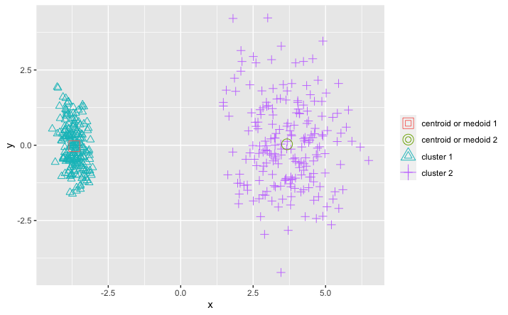

```{r setup, include=FALSE}
knitr::opts_chunk$set(echo = TRUE)
```

\abstract{

Clustering is an unsupervised learning technique where the model is adjusted to the observations. This technique is quite common among researchers because they can obtain knowledge quickly and easily. The use of this technique is suitable for automatically classifying data to reveal concentrations of data. This paper presents the Clustering package which contains a sest of clustering algorithms with two objectives: first grouping data in an homogeneous way by establishing differences between clusters, and second generating a ranking between algorithms and the variables analysed in the dataset. This package contains references to other R packages without using external software. As a complement to the standard execution through the console, it incorporates a GUI through which we can execute the package without having to know the parameters.
}

# Introduction

Exploring the properties of information in order to make groups is an unsupervised learning technique known as clustering [@b46] [@b47]. This technique is a concise data model where a set of data must be partitioned and introduced in groups or clusters. These clusters must meet two conditions: clusters must be the most disparate possible among them, and the elements that contain them the most similar. If we review the literature related to clustering we can see that the fields where they can be applied are multiple, among which we highlight the following: Identify tourists and analyze their destination patterns from location-based social media data [@b1], clustering algorithm that maximizes performance on 5G heterogeneous networks [@b2], Application of data mining techniques to agriculture data [@b3], Weighting of characteristics based on strength between categories and within categories for the analysis of feelings [@b4], Music classification, genres and taste patterns [@b5], Predict the direction, maximum, minimum and closing prices of the daily exchange rate of bitcoins [@b6] and Clustering of people in a social network based on textual similarity [@b7].  
As a rule, the clustering algorithms are based on the optimization of an objective function, which is usually the weighted sum of the distance to the centers, although these functions may vary and in some cases consists of the definition of functions. In the literature we can group the data in different ways among which we highlight [@b48]: partitional, hierarchical or based on density. One of the best known algorithms that solves the clustering problem is the k-means [@b49].  
Throughout the literature we have located a wide variety of frameworks that work with clustering algorithm implementations among which we can cite the following: Weka [@b13], ClustVis [@b14] and Keel [@b15] among others. Also within R there is a specific Cluster task view. Inside this section we see two well differentiated parts: on one hand we have the most outstanding packages by functionality and in second place we observe the set of packages that work with cluster ordered. From the set of packages we highlight the following: **ClusterR** [@b9], **apcluster** [@b10], **cluster** [@b11], **advclust** [@b12] as well as alternatives to the traditional implementation of k-means and agglomerative hierarchical clustering.  
This contribution presents the **Clustering** package. It is a package that allows you to compare multiple clustering algorithms simultaneously and assess the accuracy of the results. The purpose of this package is to evaluate a set of datasets to determine which variables are most suitable for clustering. So we can make evaluations of the clusters created, how they have been distributed, if the distributions are uniform or how they have been categorized from the data.  
The distribution of the content of this contribution is as follows: Firstly, in section \ref{clustering} we have the  presentation of clustering, types of clustering and similarity measures. Section \ref{seccion2} presents the definition of the evaluation measures in order to value the distribution of the data in the clusters and finally Section \ref{seccion3} describes the structure of the package and it presents a complete example about the use of the package.

# Clustering \label{clustering}

Cluster analysis is an unsupervised learning method that constitutes a cornerstone of an intelligent data analysis process. It is used for the exploration of inter-relationships among a collection of patterns, by organizing them into homogeneous clusters. It is called unsupervised learning because unlike classification (known as supervised learning), no a priori labeling of some patterns is available to use in categorizing others and inferring the cluster structure of the whole data [@b17]. The basic concept of clustering should be expressed as follows:

> "Clustering is the process of identifying natural clusters or clusters within multidimensional data based on some measure of similarity (Euclidean, Manhattan) [@b18]. "

This is a base definition of the clustering so variations in the problem definition can be significant, depending mostly on the model specified. For example, a generative model should define similarity based on a probabilistic generative mechanism, while a distance-based approach will use a traditional distance function to quantify it. In addition, the types of data specified also have a significant impact on the problem definition.

## Clustering types

There are a variety of clustering algorithms that can be classified into: hierarchical, partitioning, density-based, grid-based and probability distribution. The most commonly used groupings are: hierarchical, part-based and density-based.
*Hierarchical clustering algorithms: create a hierarchical breakdown of data into a dendogram that recursively divides the data set into smaller and smaller data. It can be created in two ways: bottom-up or top-down [@b19]. In bottom-up trees also known as agglomerative, as the objects are successively combined according to the measurements, until they are all joined into one or meet a completion condition.  In the case of top-down, it is known as divisive, where all the objects are in the same group, and as we iterate they are divided into smaller subsets, until each object is in an individual group or fulfills a condition of completion. An example of this type of clustering can be found in the Figure \ref{hierarchical}. Some hierarchical grouping algorithms that belong to this sorting mode are CURE [@b20], CHAMELEON [@b21], and BIRCH [@b22].

{ width=90% }  
*Partial clustering: is considered to be the most popular of the clustering algorithms [@b23]. Such an algorithm is also known as an iterative relocation algorithm. This algorithm minimizes a given clustering criterion by iteratively relocating data points between clusters until an optimal partition is reached. This type of algorithm divides the data points into a partition k, where each partition represents a cluster.
Partial clustering organizes the objects within k clusters so that the total deviation of each object from the center of its cluster or from a cluster distribution is minimal. The deviation of a point can be evaluated differently according to the algorithm, and is generally known as a similarity function.
If we want to observe graphically how this type of clustering works we can see it in the Figure \ref{partitional}. Among the partitioning clustering algorithms we can find CLARANS, CLARA [@b24], K-prototype [@b25], K-mode [@b26] and K-means [@b27].
{ width=90% }  

# References
